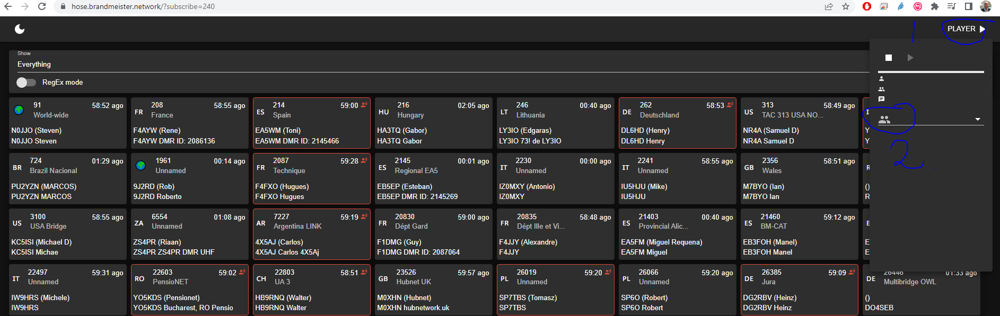

# Hoseline

Det finns en tjänst i BrandMeister som heter Hoseline. Där kan du via en webbläsare lyssna på trafiken på olika talgrupper.&#x20;

För SM Se/lyssna här; [https://hose.brandmeister.network/?subscribe=240](https://hose.brandmeister.network/?subscribe=240)

&#x20;

För att välja en specifik talgrupp att lyssna på klickar du på spelaren längst upp i hörnet (märkt med 1) i bilden. Sedan vid 2 i bild klickar du och skriver in den talgrupp som önskas. Börjar du skriva 240 kommer du i rullistan se ett urval av alla svenska talgrupper som det går att lyssna på.

Hoseline är ett mycket bra verktyg för att lyssna på sig själv. &#x20;
